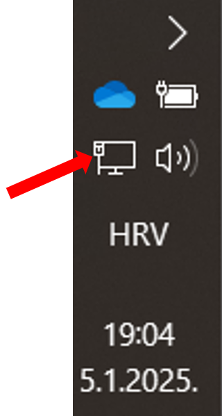
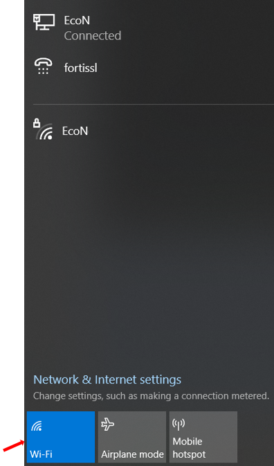

# wifi_icon
Show icon in taskbar when Wi-Fi enabled.

## Before

I have wired connection. Is Wi-Fi enabled?

Yes, Wi-Fi is enabled

## Now

Red-on-white icon shows that Wi-Fi is enabled

## Instalacija
> Croatian is easy with Google Translate

0. Instaliraj [AutoHotkey](https://www.autohotkey.com/)
   - Pokreni `resources/AutoHotkey_1.1.37.02_setup.exe`
   - Ili downloadaj verziju 1.1 sa službene web stranice https://www.autohotkey.com/
1. Odredi direktorij u kojem će se nalaziti ovaj program
   - Ovaj direktorij stavi negdje na disk.
    Npr. trenutno je napravljeno za direktorij "C:\ProgramsPortable\wifi_icon"
2. U program upiši kamo si ga stavio
   - Otvori datoteku WiFiStatus.ahk i u njoj u drugi redak upiši u koji direktorij si stavio/la i spremi.
3. Kopiraj program
   - Kopiraj datoteku WiFiStatus.ahk (u win exploreru desni klik "Copy").
4. Nađi i otvori startup direktorij
   - Pritisni tipke Win+R i upiši "shell:startup"
   - Otvorit će ti se windows explorer u "win startup direktoriju".
5. Zalijepi program u startup direktorij
   - U ovaj direktorij zaljepiš onu datoteku (desni klik "Paste").

## Todo
- Da složim python program da se ne treba instalirati AutoHotkey?
  - Nije bitno jer to neće puno povećati sigurnost.
- Da napravim ljepšu ikonu?